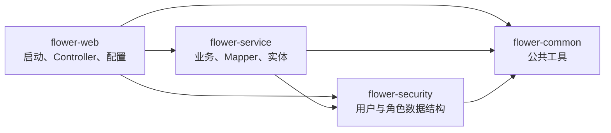
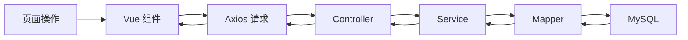

# 花卉销售管理系统：项目总览与目录结构零基础讲解

## 1. 先用一句话认识项目

这是一个鲜花销售与 DIY 花束定制系统：

- 普通用户可以浏览花材、下单、模拟支付、取消订单、确认收货和设计 DIY 花束。
- 管理员可以管理用户、花材、订单和 DIY 方案，并处理发货。
- DIY 花束支持选择花材、拖拽摆放、包装、模板、保存、详情还原和直接下单。

技术架构的准确表述是：

> 系统采用 Vue 3 + Vite 与 Spring Boot 的前后端分离开发方式，通过 REST API 通信；部署时将前端构建产物集成到 Spring Boot，实现单 JAR、单端口运行。

“前后端分离开发”与“答辩时只启动一个后端”并不矛盾：开发阶段前端和后端分开运行，打包后前端页面会放入 Spring Boot，由同一个 `8081` 端口提供。

## 2. 把整个项目想成一家鲜花店

| 项目部分 | 生活化比喻 | 实际职责 |
| --- | --- | --- |
| `flower-frontend` | 顾客看到的店面 | 展示页面、接收点击和输入、调用后端接口 |
| `flower-web` | 店铺大门和前台 | 启动系统、接收 HTTP 请求、检查登录权限 |
| `flower-service` | 店长和业务大脑 | 执行下单、支付、库存、DIY 等业务规则 |
| `flower-security` | 用户与身份资料柜 | 保存用户、角色相关实体、DTO 和 VO |
| `flower-common` | 公共工具箱 | 放统一响应、异常、JWT 工具和公共配置 |
| MySQL `flower_sales` | 仓库和账本 | 长期保存用户、花材、订单、DIY 等数据 |

老师如果问“为什么要分层”，可以回答：

> 页面展示、接口接收、业务规则和数据库访问的职责不同。分层后每部分只处理自己的事情，代码更容易定位、测试和维护。

## 3. 当前项目有多大

根据当前源码只读统计，不包含构建目录和前端依赖目录：

- Java 文件：68 个
- Vue 文件：16 个
- `flower-frontend/src` 下 JavaScript 文件：4 个

四个后端模块的 Java 文件数量：

| 模块 | Java 文件数 |
| --- | ---: |
| `flower-common` | 11 |
| `flower-security` | 6 |
| `flower-service` | 31 |
| `flower-web` | 20 |

它比中州养老小很多。目录比苍穹外卖多，主要是因为它把不同职责拆成了模块，并不代表要同时理解全部源码。

## 4. 根目录先看哪些内容

项目根目录是：

`D:\GProject\flower_trae\flower-sales`

第一次只需要认识下面这些：

```text
flower-sales
├─ pom.xml                         后端四模块的总 Maven 配置
├─ flower-common                  公共工具模块
├─ flower-security                用户与角色数据结构模块
├─ flower-service                 业务、实体、Mapper 模块
├─ flower-web                     后端启动、Controller、配置模块
├─ flower-frontend                Vue 3 前端源码
├─ docs                           项目文档与学习材料
├─ imags                          项目图片源素材
├─ .run                           IDEA 共享运行配置
├─ IDEA启动与前端同步使用方案.md   运行和前端同步的详细说明
├─ CONTEXT.md                     项目历次进展和交接记录
└─ AGENTS.md                      项目操作规则
```

不建议第一次就逐个打开所有目录。先理解最上面的六个代码部分即可。

## 5. 根 pom.xml 是后端总目录

根目录 `pom.xml` 的打包类型是 `pom`，并声明四个模块：

```xml
<modules>
    <module>flower-common</module>
    <module>flower-security</module>
    <module>flower-service</module>
    <module>flower-web</module>
</modules>
```

可以把根 `pom.xml` 想成学校的总课程表：它知道有哪几个班级，还统一规定 Java 版本和依赖版本。

当前后端重要基础信息：

- Spring Boot：`3.5.11`
- Java：`17`
- MyBatis-Plus：`3.5.5`
- MySQL Connector：`8.0.33`
- 后端项目版本：`1.0.0`

答辩时一般不需要主动背全部小版本。老师问技术栈时，回答 Vue 3、Vite、Spring Boot、MyBatis-Plus、MySQL 和 Java 17 即可；被追问再说明具体版本。

## 6. 四个后端模块

### 6.1 flower-common：公共工具箱

主要内容包括：

- `ResponseResult`：统一接口返回格式。
- `PageBean`：分页数据结构。
- `BaseException`、`GlobalExceptionHandler`：统一处理业务异常。
- `JwtUtil`：JWT 的签发和校验工具。
- 公共常量、枚举和配置。

为什么单独放一个模块？

因为这些工具可能同时被其他模块使用。如果每个模块都复制一份，修改时容易漏掉。

### 6.2 flower-security：身份资料柜

当前主要保存：

- `User`：用户实体。
- `Role`：角色实体。
- `UserRole`：用户和角色的关联。
- 登录相关 DTO、VO。

注意：模块名虽然叫 `security`，但它不是把所有权限逻辑都包在里面。真正的请求拦截和权限判断还会出现在 `flower-web` 的 `JwtInterceptor`、`AuthContext` 等类中。

### 6.3 flower-service：业务大脑

这是后端文件最多的模块，主要分为四类：

- `entity`：与数据库表对应的数据对象。
- `mapper`：访问数据库。
- `service`：业务接口。
- `service/impl`：业务接口的具体实现。

例如下单时，Service 不只是“保存订单”，还要处理：

- 商品是否存在。
- 商品是否启用。
- 库存是否足够。
- 价格以数据库为准。
- 订单、明细和库存是否在同一个事务中完成。

因此 Service 可以理解为“决定能不能做、应该怎么做”的地方。

### 6.4 flower-web：入口和前台

主要内容包括：

- `FlowerApplication`：整个后端的启动入口。
- `controller`：接收浏览器发来的 HTTP 请求。
- `config`：拦截器、权限、初始化和 Web 配置。
- `dto`：接收订单、DIY 等接口请求的数据结构。
- `application.yml`：端口、数据库、MyBatis-Plus 等配置。
- `static`：答辩单端口版本使用的前端构建产物和图片。

`flower-web` 依赖其他三个模块，并通过 Spring Boot Maven 插件生成可运行的 JAR。

## 7. 模块之间的依赖关系



读图方法：箭头表示“左边需要使用右边”。

例如 `flower-web` 的 Controller 需要调用 `flower-service` 的业务方法，所以 `flower-web` 依赖 `flower-service`。

## 8. flower-frontend：用户真正看到的页面

前端主要目录是：

```text
flower-frontend
├─ package.json            前端项目说明和依赖清单
├─ vite.config.js          Vite 端口和代理配置
├─ index.html              前端 HTML 入口
└─ src
   ├─ main.js              创建并挂载 Vue 应用
   ├─ App.vue              顶层组件，显示当前路由页面
   ├─ router/index.js      页面地址和 Vue 组件的对应关系
   ├─ api/index.js         Axios 统一配置
   ├─ constants            业务状态常量
   ├─ components           页面和复用组件
   └─ style.css            全局样式
```

几个重要页面：

| 页面 | 当前真实 Vue 组件 |
| --- | --- |
| 登录 | `LoginPage.vue` |
| 注册 | `RegisterPage.vue` |
| 用户首页 | `HomePage.vue` |
| 我的订单 | `OrderCenter.vue` |
| DIY 工作台 | `DiyPageMigrated.vue` |
| DIY 方案列表 | `DiyPlanList.vue` |
| DIY 详情 | `DiyPlanDetailMigrated.vue` |
| DIY 共用画布 | `BouquetCanvas.vue` |
| 管理后台 | `AdminLayout.vue`、`AdminDashboard.vue` |

项目中还保留了旧的 `DiyPage.vue` 和 `DiyPlanDetail.vue`，但当前路由实际使用的是带 `Migrated` 的版本。学习和答辩应以路由中正在使用的组件为准。

## 9. MySQL：系统的仓库和账本

数据库 Schema 名为：

`flower_sales`

目前只需要先知道它保存以下几类信息：

- 用户和角色
- 花材和分类
- 订单和订单明细
- DIY 方案和 DIY 明细
- 包装类型

后续《数据库表关系、事务与状态流转专题》会再解释具体表名、主键、外键式关联和状态字段。第一阶段不要急着背表结构。

## 10. 一次页面操作怎样穿过整个项目

以后学习每个功能都统一使用这条路线：



以“用户点击模拟支付”为例，先只理解概念：

1. 用户在“我的订单”页面点击按钮。
2. Vue 组件收集当前订单 ID。
3. Axios 向后端发送 HTTP 请求。
4. Controller 接收请求并确认请求格式。
5. Service 检查是不是订单本人、当前状态能不能支付。
6. Mapper 更新数据库订单状态。
7. 处理结果沿原路返回页面。

准确文件、方法和状态变化会在对应学习卡中展开。

## 11. 为什么不改成苍穹外卖那种单工程

苍穹外卖把页面资源和后端放在一个 Maven 工程中，看起来更直观；当前花卉系统采用独立 Vue 源码和多模块后端。

不重写的原因：

- 当前代码已经封版并通过人工彩排。
- Vue Router、登录状态、用户端和管理端都依赖现有结构。
- DIY 画布包含拖拽、旋转、缩放、保存和还原，重写风险很高。
- 合并目录不会自动让业务逻辑变简单。
- 答辩真正需要的是能讲清结构，不是让结构看起来和另一个项目完全一样。

可以把它理解为：苍穹外卖是“一个大教室”，花卉系统是“同一所学校里的四个小教室”。学生总数并没有变多，只是分班方式不同。

## 12. 第一次阅读源码的正确顺序

不要按照文件夹从上到下全部看。推荐顺序：

1. `flower-web/src/main/java/com/flower/FlowerApplication.java`
2. `flower-frontend/src/router/index.js`
3. 选择一个具体页面组件。
4. 找页面里调用的 API。
5. 找对应 Controller。
6. 找 Controller 调用的 Service。
7. 找 Service 使用的 Mapper 和实体。

每次只追踪一个功能。例如今天只看“登录”，不要同时看订单和 DIY。

## 13. 常见误区

### 误区一：模块多就一定是微服务

不是。当前项目是多模块的 Spring Boot 单体应用，最终生成一个主要可运行 JAR，不是多个独立微服务。

### 误区二：前后端分离就必须部署两个端口

不是。前后端可以分开开发，再把前端构建结果放进 Spring Boot，最终使用一个端口部署。

### 误区三：Mapper 负责所有业务

不是。Mapper 主要负责数据库访问；能否取消、是否恢复库存、是否允许重复下单等规则应由 Service 控制。

### 误区四：前端隐藏按钮就等于有权限保护

不是。前端隐藏按钮只是改善体验，真正的权限边界必须由后端再次检查。

### 误区五：DIY 保存就应该马上扣库存

当前设计不是这样。保存方案只保存设计；真正创建订单时才重新检查并扣减库存，后续专题会详细解释。

## 14. 本材料验收

不看材料，尝试完成以下任务：

1. 画出六个方框：前端、web、service、security、common、MySQL。
2. 用箭头画出它们的大致关系。
3. 用一句话解释每个部分。
4. 在 IDEA 中找到 `FlowerApplication.java`。
5. 在 IDEA 中找到当前 DIY 路由使用的组件。
6. 回答“这个项目是不是微服务”。

建议答案：

> 这不是微服务，而是一个多模块 Spring Boot 单体应用。开发时 Vue 与 Spring Boot 分开运行，答辩部署时将前端构建产物集成进 Spring Boot，以单 JAR、单端口运行。
