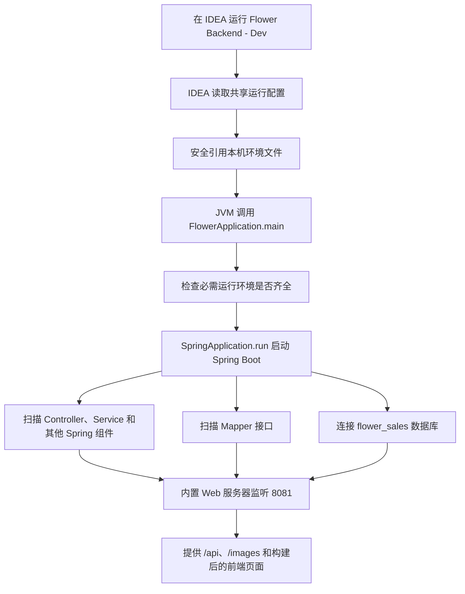
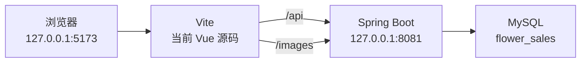

# FlowerApplication 启动流程、npm/Vite 与端口说明

## 1. 最先记住的一句话

> 开发修改前端时看 `5173`；毕业答辩使用已封版版本时看 `8081`。

当前项目实际共享的 IDEA 运行配置有三个：

| IDEA 配置 | 启动内容 | 正常访问地址 | 使用场景 |
| --- | --- | --- | --- |
| `Flower Backend - Dev` | Spring Boot 后端 | `http://127.0.0.1:8081/` | 后端开发、当前封版答辩演示 |
| `Flower Frontend - Dev` | Vite 前端 | `http://127.0.0.1:5173/` | 只启动前端开发服务 |
| `Flower Full Stack - Dev` | 同时启动上面两个 | `http://127.0.0.1:5173/` | 日常修改和调试 Vue 源码 |

当前已经有可用的 8081 封版前端资源。答辩时运行 `Flower Backend - Dev`，访问 `http://127.0.0.1:8081/` 即可，不要另建不带本机环境配置的临时 `FlowerApplication`。

## 2. FlowerApplication 是什么

文件位置：

`flower-web/src/main/java/com/flower/FlowerApplication.java`

它是 Java 后端的总启动入口，作用类似苍穹外卖中的启动类。

核心结构可以简化理解为：

```java
public static void main(String[] args) {
    检查必需的本机运行配置;
    SpringApplication.run(FlowerApplication.class, args);
}
```

真实代码在启动 Spring Boot 前，会检查本机所需的 JWT 和数据库连接环境是否已经配置。学习时只需要知道“运行配置必须齐全”，不要读取、复制或展示真实值。

## 3. 点击运行以后发生了什么



逐步解释：

1. IDEA 找到 `Flower Backend - Dev` 配置。
2. 配置指定启动模块为 `flower-web`，启动类为 `com.flower.FlowerApplication`。
3. 配置只引用本机 `.idea/flower-sales-dev.env`，不会把其中内容写入 Git。
4. Java 虚拟机执行 `main` 方法。
5. 程序检查必需环境是否存在，但不会在正常材料中显示真实值。
6. Spring Boot 创建并管理 Controller、Service、配置类等对象。
7. MyBatis 扫描 `com.flower.mapper` 下的 Mapper。
8. 内置 Web 服务器在 `8081` 等待浏览器请求。

## 4. 三个关键注解

`FlowerApplication` 上有三个重要注解：

### 4.1 `@SpringBootApplication`

生活化理解：Spring Boot 的“总开关”。

它告诉程序：这是 Spring Boot 启动类，请进行自动配置并从这里开始扫描项目。

### 4.2 `@ComponentScan(basePackages = "com.flower")`

生活化理解：通知学校去哪些班级点名。

它会寻找 `com.flower` 包下面由 Spring 管理的 Controller、Service、配置类等。

### 4.3 `@MapperScan(basePackages = "com.flower.mapper")`

生活化理解：专门登记负责数据库工作的人员。

它让 MyBatis 找到 Mapper 接口，并为这些接口创建实际可调用的数据库访问对象。

## 5. 为什么 8081 能同时打开页面和接口

`application.yml` 中设置：

```yaml
server:
  port: 8081
```

因此 Spring Boot 默认监听 `8081`。

答辩版本的前端构建产物已经放在：

`flower-web/src/main/resources/static`

其中 `index.html` 当前引用：

- `/assets/index-6qqg9LBY.js`
- `/assets/index-Dx82mHoo.css`

Spring Boot 启动后可以同时提供：

- `/`：前端首页入口
- `/assets/...`：构建后的 JavaScript 和 CSS
- `/images/...`：花材与 DIY 图片
- `/api/...`：后端 REST API

`SpaController` 还会把 `/login`、`/register`、`/user/**` 和 `/admin/**` 转发给 `index.html`，再由 Vue Router 决定显示哪个页面。

这就是“一个 JAR、一个端口也能运行完整前后端”的原因。

## 6. npm 是什么

最适合你的理解方式是：

> npm 可以先理解成“前端世界的 Maven”。

| Java 后端 | Vue 前端 | 作用 |
| --- | --- | --- |
| `pom.xml` | `package.json` | 记录项目需要哪些依赖和命令 |
| Maven | npm | 管理依赖、执行项目脚本 |
| `mvn package` | `npm run build` | 生成可以部署的构建产物 |
| Maven 插件 | npm scripts | 执行编译、开发、打包等任务 |

两者并不完全相同，但这个类比足够用于第一阶段理解。

当前真正的前端项目配置在：

`flower-frontend/package.json`

它声明了：

- Vue：构建页面组件。
- Vue Router：根据地址切换页面。
- Axios：调用后端接口。
- Element Plus：提供部分界面组件。
- Vite：启动开发服务和构建前端。

## 7. Vite 是什么

Vite 是前端开发和构建工具，可以把它理解成“前端开发车间”。

它有两项最重要的工作：

### 7.1 开发服务

运行 `npm run dev` 时，Vite：

- 读取 `flower-frontend/src` 中的当前 Vue 源码。
- 在 `5173` 提供页面。
- 保存代码后快速更新浏览器页面。
- 把 `/api` 和 `/images` 请求转发到后端 `8081`。

### 7.2 正式构建

运行 `npm run build` 时，Vite：

- 把多个 Vue、JavaScript 和 CSS 源文件处理成浏览器可执行的静态文件。
- 输出到 `flower-frontend/dist`。
- 生成带哈希名称的文件，例如 `index-xxxx.js`。

只有在前端源码发生正式修改并准备更新 8081 版本时，才需要重新构建和同步。当前使用已经封版的答辩包时通常不需要运行 npm。

## 8. 开发模式：5173 和 8081 同时工作

日常修改 Vue 源码时，运行：

`Flower Full Stack - Dev`

它会同时启动：

- Spring Boot：`8081`
- Vite：`5173`

浏览器访问：

`http://127.0.0.1:5173/`

请求关系如下：



`vite.config.js` 中明确配置：

- Vite 端口为 `5173`。
- `/api` 转发到 `http://localhost:8081`。
- `/images` 转发到 `http://localhost:8081`。

因此，`5173` 页面可以一边使用最新 Vue 源码，一边正常调用后端和加载图片。

## 9. 答辩模式：只使用 8081

当前答辩版前端已经构建并同步进 Spring Boot。

答辩时：

1. 在 IDEA 运行 `Flower Backend - Dev`。
2. 等后端启动完成。
3. 访问 `http://127.0.0.1:8081/`。
4. 登录和演示均在这个地址完成。

此时浏览器加载的是 Spring Boot `static` 中的构建结果，不是实时读取 `.vue` 源文件。

答辩前不要临时执行以下操作：

- 不要新建另一个不带环境配置的 `FlowerApplication`。
- 不要随意重新执行 `npm run build`。
- 不要把其他项目的 `dist` 复制进来。
- 不要删除后端 `static/images`。
- 不要展示或发送账号和运行凭据。

## 10. 怎样判断自己打开的是哪一种页面

### 10.1 当前 Vue 开发页面

地址通常是：

`http://127.0.0.1:5173/`

页面 HTML 会加载：

- `/@vite/client`
- `/src/main.js`

说明浏览器正在使用 Vite 和当前源码。

### 10.2 8081 封版页面

地址是：

`http://127.0.0.1:8081/`

页面 HTML 会加载：

- `/assets/index-*.js`
- `/assets/index-*.css`

说明浏览器正在使用已经构建的静态资源。

## 11. 为什么地址中会出现 `#/user/diy`

当前 Vue Router 使用 `createWebHashHistory()`。

所以 DIY 开发地址通常写成：

`http://127.0.0.1:5173/#/user/diy`

`#` 后面的部分主要由浏览器中的 Vue Router 处理。它决定显示登录、用户首页、订单中心、DIY 或管理后台等组件。

当前真实路由关系包括：

- `/user/home` → `HomePage.vue`
- `/user/orders` → `OrderCenter.vue`
- `/user/diy` → `DiyPageMigrated.vue`
- `/user/plans` → `DiyPlanList.vue`
- `/user/plan/:id` → `DiyPlanDetailMigrated.vue`
- `/admin` 及子路由 → `AdminLayout.vue`、`AdminDashboard.vue`

## 12. Axios 在哪里参与

统一 Axios 配置在：

`flower-frontend/src/api/index.js`

其中 `baseURL` 是 `/api`。页面写：

```js
api.get('/flower/list')
```

浏览器实际请求的是：

`/api/flower/list`

在开发模式下，Vite 再把它转发到 `8081`；在答辩模式下，页面本来就在 `8081`，所以直接访问同一端口的后端接口。

Axios 还会在已有登录状态时自动携带认证信息；收到 HTTP `401` 时会清除失效登录状态并返回登录页。具体登录和 JWT 原理将在后续学习卡中解释。

## 13. 常见启动信息怎样理解

后端成功时常见英文信息：

> `Tomcat started on port 8081 (http)`

中文含义：内置 Tomcat 已经在 `8081` 端口启动，可以接收 HTTP 请求。

前端成功时常见英文信息：

> `Local: http://127.0.0.1:5173/`

中文含义：Vite 前端已经可以通过本机 `5173` 地址访问。

如果看到：

> `Address already in use`

中文含义：目标端口已经被另一个进程占用。不要直接结束归属不明的进程，应先确认是不是自己已经启动了一份项目。

## 14. 零基础故障判断

### 14.1 5173 打不开

依次检查：

1. 是否运行了 `Flower Frontend - Dev` 或 `Flower Full Stack - Dev`。
2. 前端控制台是否显示 `5173` 地址。
3. 是否误打开了 `8081`。

### 14.2 5173 页面打开，但数据或图片失败

通常说明前端已经启动，但后端 `8081` 没有正常工作。因为 `/api` 和 `/images` 都要转发给后端。

### 14.3 8081 打不开

依次检查：

1. 是否运行了 `Flower Backend - Dev`。
2. 是否误建了缺少本机环境配置的临时运行项。
3. MySQL 是否可以连接。
4. `8081` 是否已被另一个项目实例占用。

不要把本机环境文件内容复制到聊天中排查。

### 14.4 8081 能打开，但不是刚改的前端

这是正常的开发/构建区别：

- `5173` 直接读取当前 Vue 源码。
- `8081` 读取上一次构建后放入 `static` 的文件。

只保存 `.vue` 文件不会自动更新 8081 的静态版本。

## 15. 答辩推荐回答

### 问：为什么有两个端口？

> 开发阶段使用 Vite 的 5173 提供实时 Vue 源码，Spring Boot 的 8081 提供 REST API 和图片，Vite 会代理后端请求。部署和答辩时，前端构建产物集成到 Spring Boot，只使用 8081。

### 问：为什么答辩只运行 FlowerApplication？

> 因为 Vue 前端已经构建为静态资源并放入 Spring Boot 的 static 目录。启动 FlowerApplication 后，8081 会同时提供前端页面、图片和后端 API。

### 问：npm 是什么？

> npm 是前端依赖和脚本管理工具，可以类比后端的 Maven。package.json 类似 pom.xml，npm run dev 启动前端开发服务，npm run build 生成部署用静态文件。

### 问：项目是微服务吗？

> 不是。它是四个 Maven 模块组成的 Spring Boot 单体应用，最终可以生成单个主要可运行 JAR。

## 16. 本材料验收

不看材料，完成以下任务：

1. 画出开发模式下浏览器、Vite、Spring Boot、MySQL 四者关系。
2. 解释为什么 `5173` 能访问 `/api` 和 `/images`。
3. 解释为什么 8081 可以打开 Vue 页面。
4. 说出三个当前真实 IDEA 共享运行配置。
5. 说出开发和答辩分别应该使用哪个配置、哪个地址。
6. 在 IDEA 中找到 `FlowerApplication.java`、`vite.config.js` 和 `package.json`。

通过标准：六项至少独立完成五项，并能在三分钟内讲清“点击运行以后发生了什么”。
